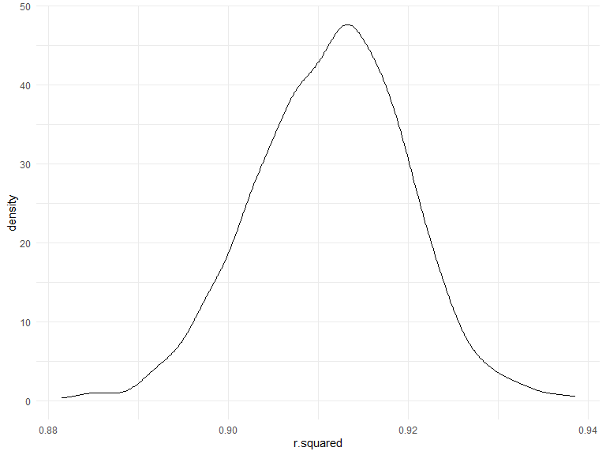
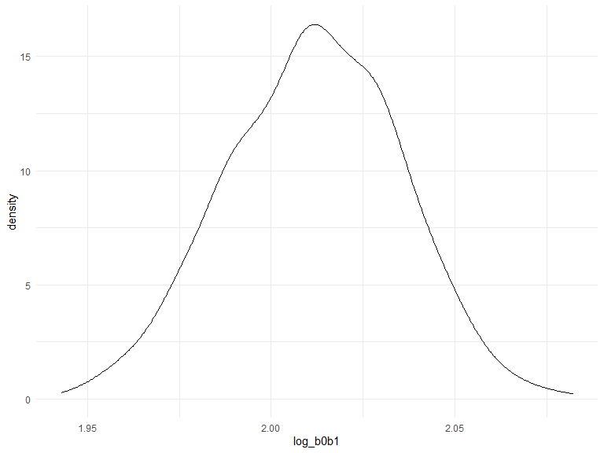
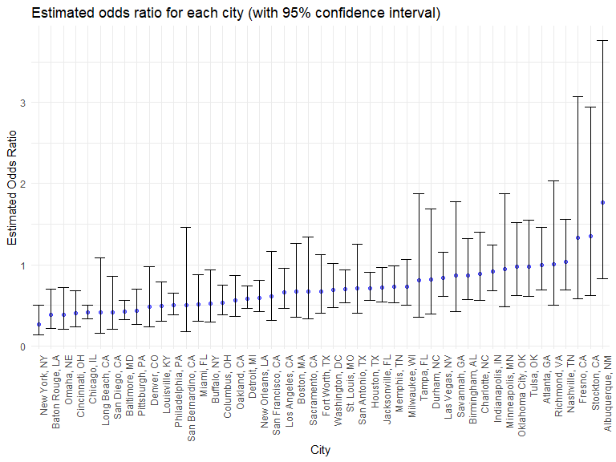

Homework 6
================
Jasmine Niu (jn2855)

## Problem 1

``` r
weather_df = 
  rnoaa::meteo_pull_monitors(
    c("USW00094728"),
    var = c("PRCP", "TMIN", "TMAX"), 
    date_min = "2017-01-01",
    date_max = "2017-12-31") %>%
  mutate(
    name = recode(id, USW00094728 = "CentralPark_NY"),
    tmin = tmin / 10,
    tmax = tmax / 10) %>%
  select(name, id, everything())
```

    ## Registered S3 method overwritten by 'hoardr':
    ##   method           from
    ##   print.cache_info httr

    ## using cached file: C:\Users\USER\AppData\Local/Cache/R/noaa_ghcnd/USW00094728.dly

    ## date created (size, mb): 2022-12-04 11:03:35 (8.445)

    ## file min/max dates: 1869-01-01 / 2022-12-31

``` r
weather_df %>% 
  modelr::bootstrap(n = 1000) %>% 
  mutate(
    models = map(strap, ~lm(tmax ~ tmin, data = .x) ),
    results = map(models, broom::glance)) %>% 
  select(-strap, -models) %>% 
  unnest(results) %>% 
  ggplot(aes(x = r.squared)) + geom_density()
```



``` r
weather_df %>% 
  modelr::bootstrap(n = 1000) %>% 
  mutate(
    models = map(strap, ~lm(tmax ~ tmin, data = .x) ),
    results = map(models, broom::tidy)) %>% 
  select(-strap, -models) %>% 
  unnest(results) %>% 
  select(id = `.id`, term, estimate) %>% 
  pivot_wider(
    names_from = term, 
    values_from = estimate) %>% 
  rename(beta0 = `(Intercept)`, beta1 = tmin) %>% 
  mutate(log_b0b1 = log(beta0 * beta1)) %>% 
  ggplot(aes(x = log_b0b1)) + geom_density()
```



## Problem 2

### Import the data and create a city_state variable

``` r
url = "https://raw.githubusercontent.com/washingtonpost/data-homicides/cbcb572ed1a3c3f10d6dfe07e84464a28986173e/homicide-data.csv"

df_base = read_csv(url)
```

    ## Rows: 52179 Columns: 12
    ## ── Column specification ────────────────────────────────────────────────────────
    ## Delimiter: ","
    ## chr (9): uid, victim_last, victim_first, victim_race, victim_age, victim_sex...
    ## dbl (3): reported_date, lat, lon
    ## 
    ## ℹ Use `spec()` to retrieve the full column specification for this data.
    ## ℹ Specify the column types or set `show_col_types = FALSE` to quiet this message.

``` r
city_check = function(df){
  
  df_new = df %>% 
    group_by(state) %>% 
    count(city)
  
  df_new %>% 
    knitr::kable()
}


city_check(df_base)
```

| state | city           |    n |
|:------|:---------------|-----:|
| AL    | Birmingham     |  800 |
| AL    | Tulsa          |    1 |
| AZ    | Phoenix        |  914 |
| CA    | Fresno         |  487 |
| CA    | Long Beach     |  378 |
| CA    | Los Angeles    | 2257 |
| CA    | Oakland        |  947 |
| CA    | Sacramento     |  376 |
| CA    | San Bernardino |  275 |
| CA    | San Diego      |  461 |
| CA    | San Francisco  |  663 |
| CA    | Stockton       |  444 |
| CO    | Denver         |  312 |
| DC    | Washington     | 1345 |
| FL    | Jacksonville   | 1168 |
| FL    | Miami          |  744 |
| FL    | Tampa          |  208 |
| GA    | Atlanta        |  973 |
| GA    | Savannah       |  246 |
| IL    | Chicago        | 5535 |
| IN    | Indianapolis   | 1322 |
| KY    | Louisville     |  576 |
| LA    | Baton Rouge    |  424 |
| LA    | New Orleans    | 1434 |
| MA    | Boston         |  614 |
| MD    | Baltimore      | 2827 |
| MI    | Detroit        | 2519 |
| MN    | Minneapolis    |  366 |
| MO    | Kansas City    | 1190 |
| MO    | St. Louis      | 1677 |
| NC    | Charlotte      |  687 |
| NC    | Durham         |  276 |
| NE    | Omaha          |  409 |
| NM    | Albuquerque    |  378 |
| NV    | Las Vegas      | 1381 |
| NY    | Buffalo        |  521 |
| NY    | New York       |  627 |
| OH    | Cincinnati     |  694 |
| OH    | Columbus       | 1084 |
| OK    | Oklahoma City  |  672 |
| OK    | Tulsa          |  583 |
| PA    | Philadelphia   | 3037 |
| PA    | Pittsburgh     |  631 |
| TN    | Memphis        | 1514 |
| TN    | Nashville      |  767 |
| TX    | Dallas         | 1567 |
| TX    | Fort Worth     |  549 |
| TX    | Houston        | 2942 |
| TX    | San Antonio    |  833 |
| VA    | Richmond       |  429 |
| wI    | Milwaukee      | 1115 |

### Tidy the data

``` r
df_tidy = df_base %>% 
  mutate(
    state = case_when(city == "Milwaukee" ~ "WI", TRUE ~ state),
    city_state = paste(city, state, sep = ", "),
    solution_status = ifelse(disposition == "Closed by arrest","solved","unsolved"),
    victim_age = as.numeric(victim_age),
    victim_race = fct_relevel(victim_race, "White"),
    victim_sex = fct_relevel(victim_sex, "Female")
  ) %>%
  filter(!city_state %in%  c("Dallas, TX", "Phoenix, AZ", "Kansas City, MO", "Tulsa, AL") & 
           victim_sex %in% c("Male", "Female") & 
           victim_race %in% c("Black", "White"))
```

### Logistic regression on Baltimore

``` r
reg_baltimore = df_tidy %>% 
  filter(city == "Baltimore") %>% 
  mutate(solution_status = fct_relevel(solution_status,"solved")) %>% 
  glm(solution_status ~ victim_age + victim_sex + victim_race, data = ., family = binomial())

save(reg_baltimore, file = "./result/reg_baltimore.RData")  
  

odds_ratio = reg_baltimore %>% 
  broom::tidy() %>% 
  mutate(
    OR = exp(estimate),
    CI_Lower = exp(estimate - 1.96*std.error),
    CI_Upper = exp(estimate + 1.96*std.error)
    ) %>%
  select(term, estimate, OR, CI_Lower, CI_Upper) %>%
  filter(term == "victim_sexMale")
```

### Logistic regression on all Cities

``` r
reg_all = 
  df_tidy %>% 
  group_by(city_state) %>% 
  mutate(
    solution_status = ifelse(solution_status == "solved", 1, 0),
    victim_sex = fct_relevel(victim_sex, "Female"),
    victim_race = fct_relevel(victim_race, "White"),
  ) %>% 
  select(city_state, solution_status, victim_age, victim_sex, victim_race) %>% 
  drop_na() %>% 
  nest(data = -city_state) %>% 
  mutate(
    glm_all = map(.x = data, ~glm(solution_status ~ victim_age + victim_sex + victim_race, data = .x, family = binomial())),
    tidy_output = map(.x = glm_all, ~broom::tidy(.x))) %>% 
  select(city_state, tidy_output) %>% 
  unnest(tidy_output) %>% 
  mutate(
    OR = exp(estimate),
    CI_Lower = exp(estimate - 1.96*std.error),
    CI_Upper = exp(estimate + 1.96*std.error)) %>%
  filter(term == "victim_sexMale") %>% 
  select(city_state, OR, CI_Lower, CI_Upper)
```

### Make a plot

``` r
reg_all %>% 
  ggplot(aes(x = fct_reorder(city_state, OR), y = OR)) +
  geom_point(alpha = 0.5, color = "blue") +
  geom_errorbar(aes(ymin = CI_Lower, ymax = CI_Upper)) +
  theme(axis.text.x = element_text(angle = 90, hjust = 1)) +
  labs(
    title = "Estimated odds ratio for each city (with 95% confidence interval)",
    x = "City",
    y = "Estimated Odds Ratio"
  )
```



## Problem 3

### Clean the data

``` r
df2 = read_csv("./data/birthweight.csv")
```

    ## Rows: 4342 Columns: 20
    ## ── Column specification ────────────────────────────────────────────────────────
    ## Delimiter: ","
    ## dbl (20): babysex, bhead, blength, bwt, delwt, fincome, frace, gaweeks, malf...
    ## 
    ## ℹ Use `spec()` to retrieve the full column specification for this data.
    ## ℹ Specify the column types or set `show_col_types = FALSE` to quiet this message.

``` r
apply(is.na(df2), 2, which)
```

    ## integer(0)

``` r
tibble(
  variable = colnames(df2),
  sapply(df2, class)) %>%
  knitr::kable()
```

| variable | sapply(df2, class) |
|:---------|:-------------------|
| babysex  | numeric            |
| bhead    | numeric            |
| blength  | numeric            |
| bwt      | numeric            |
| delwt    | numeric            |
| fincome  | numeric            |
| frace    | numeric            |
| gaweeks  | numeric            |
| malform  | numeric            |
| menarche | numeric            |
| mheight  | numeric            |
| momage   | numeric            |
| mrace    | numeric            |
| parity   | numeric            |
| pnumlbw  | numeric            |
| pnumsga  | numeric            |
| ppbmi    | numeric            |
| ppwt     | numeric            |
| smoken   | numeric            |
| wtgain   | numeric            |

``` r
df2_tidy = df2 %>%
  mutate(parity_bin = case_when(parity == 0 ~ 0, TRUE ~ 1)) %>%
  mutate(across(c(babysex, frace, malform, mrace, parity_bin), as.factor))  
```
